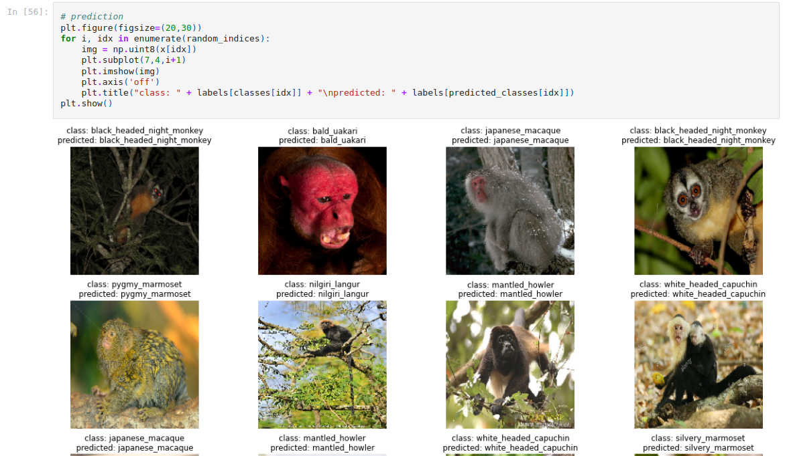
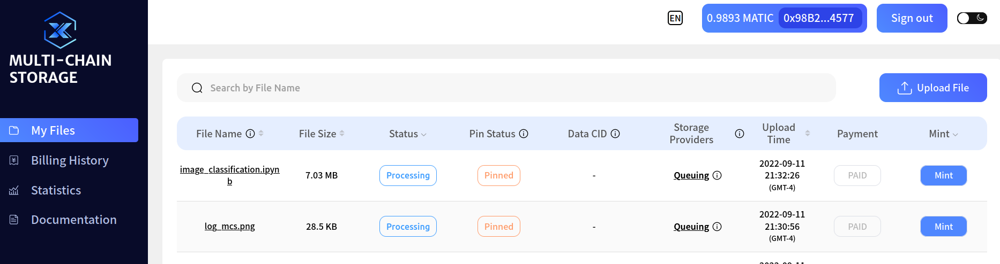

# ipfs-computing-router


IPFS Computing Router enable user to store and fetch dataset from the closest IPFS node and upload the training result
to the same node available.

## Installation

```shell
$ pip install -r requirements.txt
```

## Data Computing

A Sample AI training job _image_classification.ipynb_ can be found in [computing](computing) folder


## Setup MCS environment file
This setup is for setting up the wallet for pay mcs backup cost.

Create an **.env** file 
```shell
wallet_address = ""
private_key = ""
web3_api = "https://matic-testnet-archive-rpc.bwarelabs.com"
```

## Gateway and Computing result

The main script compares two IPFS gateways:

```shell
https://mcs.filswan.com 
https://ipfs.io
```

The script will choose the one has less latency and backup the computing result to it.

```html
mcs.filswan.com Montréal
ipfs.io San Francisco
ipfs_io_response_time 0.091187
mcs_response_time 0.084746
Chose mcs gateway
url: https://mcs-api.filswan.com/api/v1/storage/ipfs/upload
body: {'wallet_address': '0x98B2D0D7439086d3c76315484363870422C14577', 'duration': '525', 'storage_copy': '5'}
url: https://mcs-api.filswan.com/api/v1/common/system/params
url: https://mcs-api.filswan.com/api/v1/billing/price/filecoin
```

If MCS is selected ,it will show your backup on MCS as follows:

https://calibration-ipfs.filswan.com/ipfs/QmYvgMcF7J7MnpaynYKMdJaqDMcSZbeF5pj34fS6V4T7TZ



It takes up to 12h for backup to Filecoin nodes.
